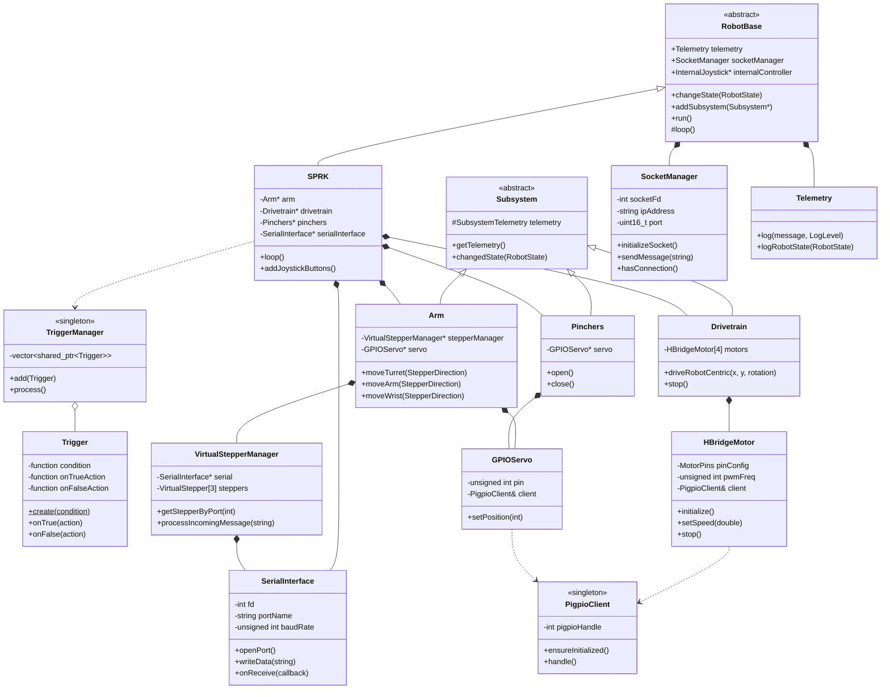
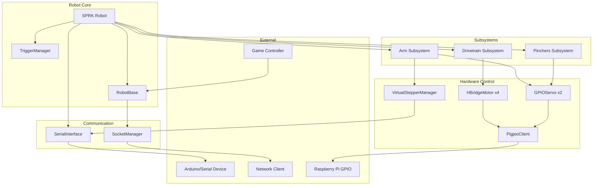
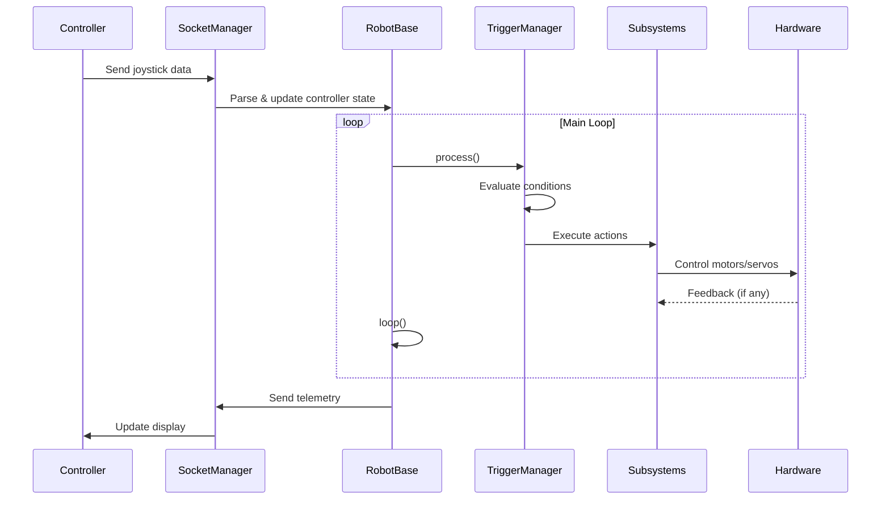

# SPRK Robot Architecture

## Class Diagram



## Component Architecture



## Directory Structure

```
src/
├── main.cpp                    # Entry point
├── SPRK.{hpp,cpp}             # Main robot class
├── Constants.hpp               # Configuration constants
│
├── base/                       # Core framework
│   ├── RobotBase.{hpp,cpp}    # Base robot class
│   ├── Subsystem.hpp           # Subsystem interface
│   ├── Telemetry.{hpp,cpp}    # Logging system
│   ├── SocketManager.{hpp,cpp} # Network communication
│   ├── SerialInterface.{hpp,cpp} # Serial communication
│   ├── Joystick.hpp            # Controller input
│   ├── Trigger.{hpp,cpp}       # Event-based triggers
│   ├── RobotEnums.hpp          # State enums
│   ├── RobotHelpers.hpp        # Utility functions
│   │
│   ├── actuation/              # Hardware control
│   │   ├── PigpioClient.{hpp,cpp}
│   │   ├── HBridgeMotor.{hpp,cpp}
│   │   ├── GPIOServo.{hpp,cpp}
│   │   ├── VirtualStepper.{hpp,cpp}
│   │   ├── VirtualStepperManager.{hpp,cpp}
│   │   └── StepperConstants.hpp
│   │
│   ├── command/                # Command pattern
│   │   ├── BaseCommand.hpp
│   │   └── AutonomousCommand.hpp
│   │
│   └── simulation/             # Simulation support
│       └── SerialSimulation.hpp
│
└── subsystem/                  # Robot subsystems
    ├── Arm.{hpp,cpp}          # Arm control
    ├── Drivetrain.hpp         # Drive base
    └── Pinchers.hpp           # Gripper mechanism
```

## Data Flow


